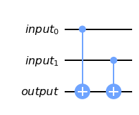
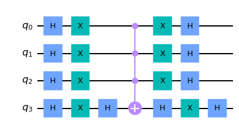
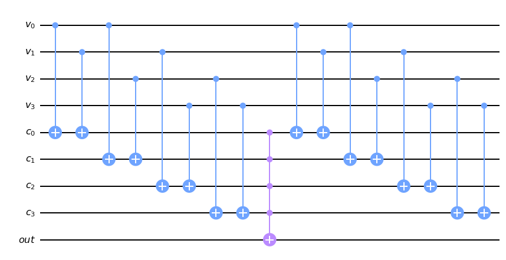
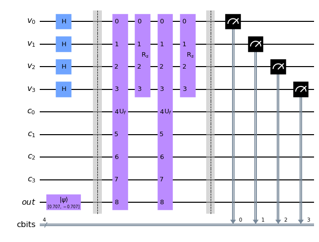
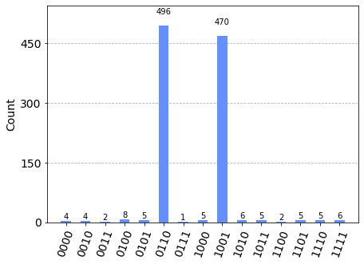

# Mira
Solving Sudoku using IBM's powerful Quantum Computation library - QisKit

## 2x2-4.ipynb
### Helpers
#### XOR Gate

This gate is helpful in comparing $input_0$ and $input_1$. It flips the $output$ qbit only when they are not equal.

#### Grover Diffuser

The $R_s$ gate is also known as the Grover Diffuser which reflects a qubit about the $\ket{s}$ where $\ket{s} = \ket{+\ldots+}$ is the superposition of all possible states for the qbit. We know,
$$R_s=2\ket{s}\bra{s}-I$$
It can be made out that,
$$R_s=H^{\otimes n}R_0H^{\otimes n}$$
$n$ is the number of qbits in the system. Here, $n$=4. Now, this tells us that the gates "sandwiched" between the Hadamard gates on either side of the diffuser makes up the $R_0$ gate which is a special case of $R_s$ gate where $\ket{s} = \ket{0}$.
The $R_0$ gate flips all the states except $\ket{00}$.
$$R_0(c_0\ket{0} + c_1\ket{1} + c_2\ket{2} + c_3\ket{3})=c_0\ket{0} - c_1\ket{1} - c_2\ket{2} - c_3\ket{3}$$
The circuit shown above for the Grover Diffuser, makes use of the fact that $\ket{\psi} \equiv -\ket{\psi}$. Therefore, it only flips $\ket{0}$ state giving the same result.

### Implementation
<table>
    <tr>
        <td>v0</td>
        <td>v1</td>
    </tr>
    <tr>
        <td>v2</td>
        <td>v3</td>
    </tr>
</table>

<!-- | --- | --- |
| $v_0$ | $v_{1}$ |
| $v_2$ | $v_{3}$ | -->

Our Sudoku is a $2\times2$ grid to be filled with 0s and 1s. A valid solution follows the follwing inequalities:

- $v_0 \neq v_1$
- $v_0 \neq v_2$
- $v_1 \neq v_3$
- $v_2 \neq v_3$

#### Oracle

The Sudoku Oracle checks if a solution is valid and accordingly sets $out$. It first checks all of inequalities mentioned above and then finally sets $out$ to $\ket{1}$ if and only if, all of the said inequalities hold.

#### Final Circuit

In our case,
$$n=4$$
$$N=2^n=16$$
$$\theta=\arcsin(\frac{1}{\sqrt{N}}) \approx 14.478\degree$$
$$(2t+1)\theta=\frac{\pi}{2}$$
$$\therefore \lfloor t \rfloor=2$$

Hence, using the combination $R_s U_f$ twice gives us the maximum amplification.

### Execution

We can infer that solutions 0110 and 1001 are valid by taking a quick look at the histogram above which is infact correct.
